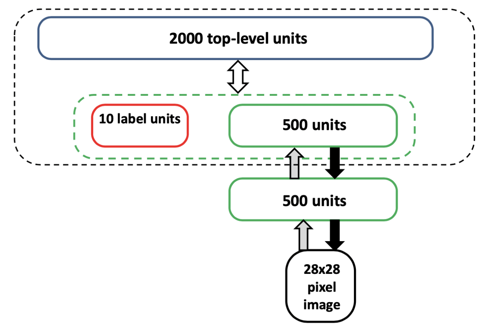
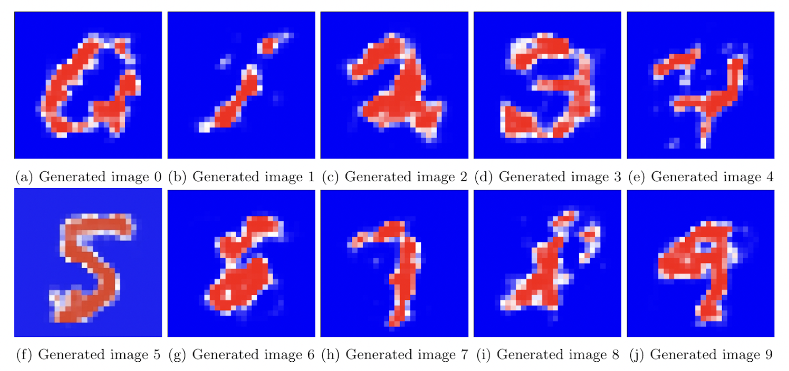

# Generative Deep Belief Network (DBN)
Project for DD2437 Artificial Neural Networks and Deep Architectures at KTH Royal Institute of Technology.

We implement a DBN trained with the MNIST dataset is used to generate numbers. 

The network can be used as a **discriminative model** for classification of input images into the correct number from 0 to 9, or as a **generative model** to generate a new number from an input label.

### Architecture
The DBN architecture used follows the following model:

### Disciminator

The best classification accuracy achieved on the test set was of **94%**, using a learning rate of 0.01 and momentum of 0.7. 
A key improvement to the model was to force a sparse representation in the hidden layers by setting a sparsity target of 0.2.

### Generator

By clamping the target label and propagating to the 28x28 pixel image, we obtain a generated image according to the probabilistic distribution that the network has learned for that given label.

Despite the simplicity of the model compared to art generative models, the images generated do bear a clear resemblance to actual numbers.

